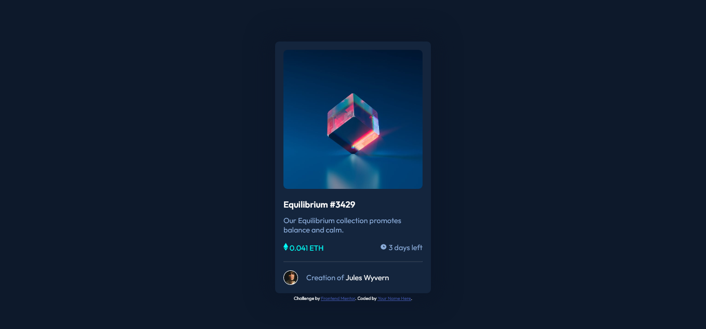

# Frontend Mentor - NFT preview card component

## Hola !✌️

este ejercicio lo realice con el fin de practicar css dado que aunque css no es un lenguaje de programcion, se puede tornar dificil en el sentido de que si no afianzas conceptos puede llegar a hacer un dolor de cabeza.

## resultado del ejercicio

cabe resaltar que como lo dice el titulo principal esta practica fue sacada de Frontend Mentor.
